<h1 align="center">Hi, I'm Siddhesh Shinde </h1>

  

  <!-- TODO: swap in your live portfolio URL once deployed -->
  
  <!-- TODO: swap in your resume link (Google Drive / PDF) -->
  

  
  
  
  

---

<h3><code>sujal@github ~ $ whoami</code></h3>
<table>
  <tr>
    <td valign="top"></td>
    <td valign="top"></td>
  </tr>
</table>

---

### About Me

Started with C in my first year of diploma — it's still the language that shaped how I think through problems. Since then, I've built an AI pipeline that automates helmet-violation flagging with a human-in-the-loop, and SAAPT — a full attendance system for BVIT Institute with 4 roles and offline sync, shipped in a week.

I'm a vibe coder when prototyping, a traditional programmer when shipping — and I care more about a product having real users than a repo having a green commit graph. Currently open to internships and freelance work where I can keep building things people actually use.

<!-- TODO: drop your resume link in the badge above once you have one -->

---

<h3><code>sujal@github ~ $ ./contributions.sh</code></h3>

 
auto-refreshes daily via GitHub Actions — nothing to update by hand

---
<h3 align="center">Tech Stack</h3>

<samp>Category</samp> | <samp>Stack</samp> |
--- | --- |
<samp>Languages</samp> |      |
<samp>Frontend</samp> |     |
<samp>Backend</samp> |    |
<samp>AI / ML</samp> |     |
<samp>Data</samp> |    |
<samp>Tools</samp> |      |

---
